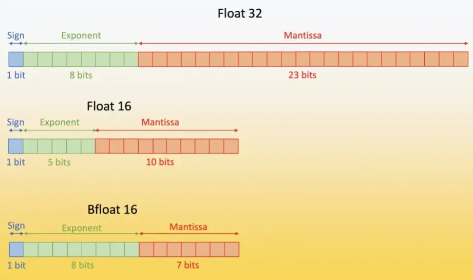
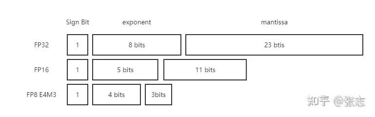
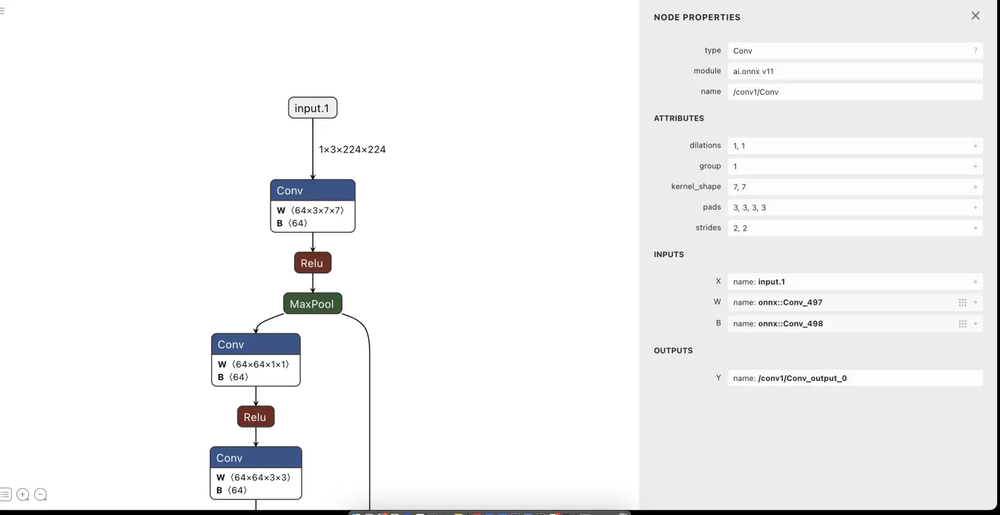
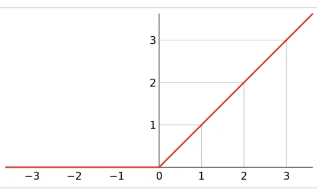
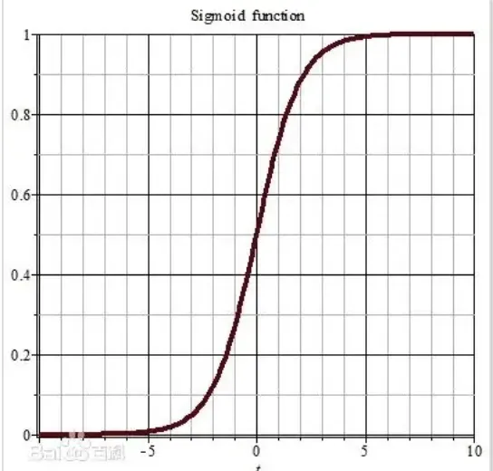
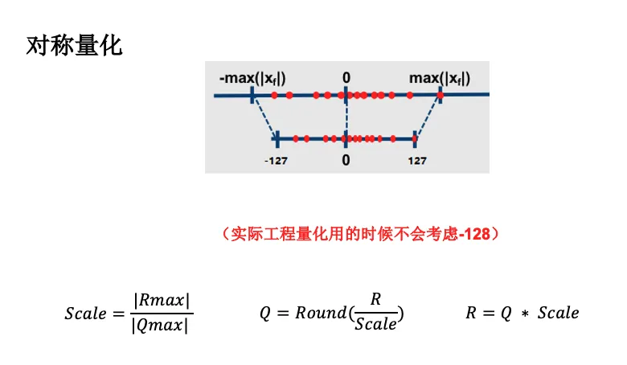

AI All in One

## 基本概念

### AGI

通用人工智能Artificial general intelligence (AGI) 是一种人工智能 (AI)，它在广泛的认知任务中达到或超越人类的认知能力。这与仅限于特定任务的狭义人工智能形成对比。 AGI 被认为是强人工智能的定义之一。

创建 AGI 是人工智能研究以及 OpenAI和 Meta 等公司的主要目标。 2020 年的一项调查发现，有 72 个活跃的 AGI 研发项目分布在 37 个国家/地区。

实现 AGI 的时间表仍然是研究人员和专家之间持续争论的话题。截至 2024 年，一些人认为它可能在几年或几十年内实现；另一些人则认为它可能需要一个世纪或更长时间。 少数人认为它可能永远无法实现，而另一少数人认为它已经存在。著名的人工智能研究人员 Geoffrey Hinton 对 AGI 的快速进展表示担忧，并表示它可能比许多人预期的更快实现。

关于 AGI 的确切定义，以及 GPT-4 等现代大型语言模型 (LLM) 是否是 AGI 的早期形式，存在争议。 AGI 是科幻小说和未来研究中的常见话题。

关于 AGI 是否代表生存风险存在争议。许多人工智能界人士表示，减轻人工智能对人类灭绝的风险应该是全球优先事项。其他人则认为 AGI 的发展太过遥远，不会带来这样的风险。

### 量化/Quantization

+ 减少内存占用
+ 加速计算
+ 减小功耗和延迟
Quantization is a technique to reduce the computational and memory costs of running inference by representing the weights and activations with low-precision data types like 8-bit integer (int8) instead of the usual 32-bit floating point (float32).
Reducing the number of bits means the resulting model requires less memory storage, consumes less energy (in theory), and operations like matrix multiplication can be performed much faster with integer arithmetic. It also allows to run models on embedded devices, which sometimes only support integer data types.

### 混合精度训练

<https://www.tensorflow.org/guide/mixed_precision?hl=zh-cn>
混合精度是指训练时在模型中同时使用 16 位和 32 位浮点类型，从而加快运行速度，减少内存使用的一种训练方法。通过让模型的某些部分保持使用 32 位类型以保持数值稳定性，可以缩短模型的单步用时，而在评估指标（如准确率）方面仍可以获得同等的训练效果。本指南介绍如何使用 Keras 混合精度 API 来加快模型速度。利用此 API 可以在现代 GPU 上将性能提高三倍以上，而在 TPU 上可以提高 60％。

### AMP

Automatic Mixed Precision
<https://pytorch.org/docs/stable/notes/amp_examples.html#>

### MoE

## 硬件

### CPU

### GPU

### TPU

Tensor Processing Unit 张量处理单元 是一款为机器学习而定制的芯片，经过了专门深度机器学习方面的训练，它有更高效能（每瓦计算能力）。

## 架构

### ONNX/Open Neural Network Exchange

The open standard for machine learning interoperability

ONNX 是一种为表示机器学习模型而构建的开放格式。ONNX 定义了一组通用运算符（机器学习和深度学习模型的构建块）和一种通用文件格式，使 AI 开发人员能够将模型与各种框架、工具、运行时和编译器一起使用。

ONNX is an open format built to represent machine learning models. ONNX defines a common set of operators - the building blocks of machine learning and deep learning models - and a common file format to enable AI developers to use models with a variety of frameworks, tools, runtimes, and compilers.
<https://onnx.ai/>

### ONNX runtime/ORT

<https://github.com/microsoft/onnxruntime>
ONNX Runtime: cross-platform, high performance ML inferencing and training accelerator

### TensorRT/TRT

<https://github.com/NVIDIA/TensorRT>
NVIDIA® TensorRT™ is an SDK for high-performance deep learning inference on NVIDIA GPUs. This repository contains the open source components of TensorRT.

NVIDIA® TensorRT™ 是一款用于在 NVIDIA GPU 上进行高性能深度学习推理的 SDK。此存储库包含 TensorRT 的开源组件。

### NV Hopper

NVIDIA Hopper架构是NVIDIA在2022 年3月推出的GPU 架构。 这一全新架构以美国计算机领域的先驱科学家 Grace Hopper 的名字命名，将取代两年前推出的 NVIDIA Ampere 架构。 [1]

### Transformer Engine/TE

https://github.com/NVIDIA/TransformerEngine

Transformer Engine (TE) 是一个用于在 NVIDIA GPU 上加速 Transformer 模型的库，包括在 Hopper GPU 上使用 8 位浮点 (FP8) 精度，以在训练和推理中以更低的内存利用率提供更好的性能。TE 为流行的 Transformer 架构提供了一组高度优化的构建块，以及一个可与特定于框架的代码无缝使用的自动混合精度 API。TE 还包括一个与框架无关的 C++ API，可以与其他深度学习库集成以启用对 Transformer 的 FP8 支持。

随着 Transformer 模型中参数数量的不断增长，BERT、GPT 和 T5 等架构的训练和推理变得非常耗费内存和计算资源。大多数深度学习框架默认使用 FP32 进行训练。然而，这对于实现许多深度学习模型的完全准确性来说并不是必不可少的。使用混合精度训练，即在训练模型时将单精度 (FP32) 与较低精度 (例如 FP16) 格式相结合，与 FP32 训练相比，可显著提高速度，同时准确度差异很小。Hopper GPU 架构引入了 FP8 精度，与 FP16 相比，其性能有所提高，而准确度没有降低。虽然所有主要的深度学习框架都支持 FP16，但目前的框架并不原生支持 FP8。

TE 通过提供与流行的大型语言模型 (LLM) 库集成的 API 来解决 FP8 支持问题。它提供了一个 Python API，其中包含可轻松构建 Transformer 层的模块以及 C++ 中与框架无关的库，包括 FP8 支持所需的结构和内核。TE 提供的模块在内部维护 FP8 训练所需的缩放因子和其他值，大大简化了用户的混合精度训练。

### Triton

https://github.com/triton-lang/triton

Triton 是一种用于编写高效自定义深度学习原语的语言和编译器。Triton 的目标是提供一个开源环境，以比 CUDA 更高的生产力编写快速代码，同时也具有比其他现有 DSL 更高的灵活性。

### ImageNet

ImageNet项目是一个用于视觉对象识别软件研究的大型可视化数据库

## 数据类型

### FP/BF

fp: float point 浮点精度
bf: brain float  
BF16是一种全新的数字格式，专门服务于人工智能和深度学习，最开始是Google Brain发明并应用在TPU上的，后来Intel，Arm和一众头部公司都在广泛使用。
以前大部分的AI训练都使用FP32，但有相关的论文证明，在深度学习中降低数字的精度可以减少tensor相乘所带来的运算功耗，且对结果的影响却并不是非常大。
FP32包含1（符号位）+ 8（指数位）+ 23（尾数位）
FP16包含1+5+10
BF16包含1+8+7

BF是brain float的缩写，和缩小了动态范围的FP16相比，它不仅拥有和FP32相同的表示范围，且更少的尾数也使它能够拥有更小的芯片面积。

### E4M3/E5M2

FP8是FP16的衍生产物，它包含两种编码格式E4M3与E5M2。对于E4M3而言，其包含4比特指数、3比特底数、以及一比特符号位。E5M2同理包含5比特指数位、3比特底数、1比特符号。在本文中，我们称指数部分为exponent, 底数部分为mantissa。下图展示了FP32, FP16, FP8的格式对比：

## 工具

### netron

深度学习可视化工具
<https://netron.app/>

## 算法

### DNN（深度神经网络）

### RNN（递归神经网络）

### CNN（卷积神经网络）

## 模型和参数

### Conv

convolution 卷积

### W

weight 权重

### B

Bias 偏差

### Gard

gradient 梯度

### Loss Curves

损失曲线

https://kelvin.legal/what-is-a-loss-curve/

### batch size

https://blog.csdn.net/qq_41813454/article/details/138356058

在深度学习的世界中，batch_size是一个至关重要的超参数。它决定了模型在训练过程中一次处理的数据量大小。选择合适的batch_size不仅可以提高模型的训练效率，还可以影响模型的泛化能力。，并通过丰富的代码示例帮助大家理解和掌握。

## 激活函数

### Relu

线性整流函数（Linear rectification function），又称修正线性单元，是一种人工神经网络中常用的激活函数（activation function），通常指代以斜坡函数及其变种为代表的非线性函数。

### Sigmoid

## 量化

### 对称量化和非对称量化

0点是否在原数据的零点
非对称量化: 偏移

对称量化：最大绝对值对称法

## 数据

### MNIST

MNIST（Modified National Institute of Standards and Technology database）是一个大型手写数字数据库，广泛用于训练和测试机器学习模型，特别是在计算机视觉领域。这个数据集包含了成千上万的手写数字图像，是进行数字识别算法研究和开发的经典数据集之一。
